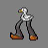

# DuckBot
  
DuckBot is a Discord bot with it's own functional-style scripting language, DuckScript.  
With DuckBot users are able to define their own commands using the scripting language mentioned above, Lua or C\# for all possible needs and purposes.  
Now with built-in audio player!  

## Getting started
To display a list of all available commands use the `help` command.  
Consecutively, all commands have a simple help section, which can be displayed using `help <command>`, where `command` is the command name you want to check out.  

### Default commands list
For more information about command usage use the help section command described above.
* `add` - Defines a new user-made command
* `remove` - Removes an user-made command
* `help` - Displays a list of all available commands
* `inform` - Sends the specified user a message, which will be delivered once the user comes back online
* `options` - Used to configure server session options
* `var` - Used to manage script-defined variables
* `playsong` - Finds and plays a song on the voice channel, if it's set
* `stopsong` - Immediately stops playing a song, if there's one playing

## Command scripting syntax
Text contained within a script is outputted exactly as it is, with the exception of a few special constructs.  
Those constructs are marked following characters: `{`, `:`, `,`, `}` and `|`. The first four are used to execute functions.  
The last is used to create a Switch-type command. More on that later.  
Special characters can be escaped by using the `^` character.  
Functions share the following syntax: `{func_name:arg_1,arg_2,...}`.  
All functions have a specified minimum amount of arguments, if more than neccessary are passed to the function, they are ignored.  
In case a function doesn't receive enough arguments or another problem occurs the function returns an error string (ie. `!FORMAT_ERROR!`).  
Functions may also be passed as arguments to another function to create nested constructs. Take note that arguments are evaluated only when actually used, in example:  
When evaluating a construct such as: `{input:0,{calc:2+2}}`, the `{calc}` function will never be called, because `{input}` uses only one argument.

### Available functions:
* `{calc:expr}` - Calculates the value of given expression (for syntax look [here on MSDN](https://msdn.microsoft.com/en-us/library/system.data.datacolumn.expression(v=vs.71).aspx))
* `{command:name,args}` - Executes an user-made command, passing the `args` as text normally passed by the user
* `{date}` - Returns the current date in short format
  * `{date:format}` - Returns the current date and time in specified `format` (ISO 8601)
* `{download:url}` - Retrieve a string from the specified URL
* `{eval:script}` - Evaluates `script` string as a script by stripping all, if any character escapes
* `{find:str,val}` - Returns the position of first occurence of `val` inside `str` string, or -1 if none were found
* `{if:str1,str2,match,else}` - Compares `str1` with `str2` and returns `match` or `else` based on whether they match or not
* `{img:url}` - Attempts to post an image downloaded from the specified URL
  * *NOTE: the image will appear before any other text*
* `{input}` - Returns the text passed by the user with the command
  * `{input:n}` - Returns only the `n`-th word of the text
* `{length:str}` - Returns the length of the `str` string
* `{mention}` - Returns a mention to the user who sent the command
  * `{mention:user}` - Returns a mention to a user with specified name
* `{nickOrUser}` - Returns the nickname of the user who sent the command, if the user has no nickname his name is returned instead
* `{or:opt1,...,optN}` - Returns first element from the argument list that is not empty and not an error
* `{rand:max}` - Returns a random number between 0 and `max`-1
  * `{rand:min,max}` - Returns a random number between `min` and `max`-1
* `{replace:str,patrn,repl}` - Replaces all occurences of `patrn` in `str` with `repl`
* `{substr:str,i}` - Returns a substring of `str` starting at position `i`, or if it's negative position `i` from the end
  * `{substr:str,i,len}` - Returns a substring of `str` starting at `i` with length of `len`, `i` negativity rule applies
* `{time}` - Returns the current time in short format
  * `{time:long}` - Returns the current time in long format
* `{user}` - Returns the name of the user who sent the command

### Special functions:
* `{get:var}` - Returns the contents of variable `var`
* `{set:var,value}` - Sets a variable named `var` to `value` in the current server session, returns nothing
  * *NOTE: variables with names prefixed by `_` are not persisted between bot runs!*

## Switch construction
Switches can help compacting a series of `{if}` functions and have a following syntax:  
```
value_to_compare
| case "value_1" result_value_1
| case "value_2" result_value_2
| default result_value_default
```  
Everything except `case` and `default` keywords may contain scripts.  
Default case is optional but recommended.  

## Lua scripts
Lua scripts run inside a sandboxed environment.  
Inside the environment it's possible to access the following parameters:
* `channel` - The object of the channel the command was sent from
* `rawText` - The text passed by the user with the command
* `sender` - The object of user who sent the command
* `server` - The current server object

Lists of those objects' accessible fields and methods can be found in Discord.Net documentation and are subject to change.  

## Have fun using the bot!
